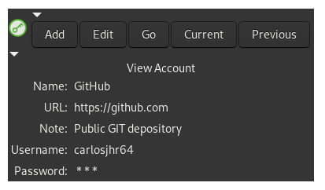

# Gtk3App

* [VERSION 5.3.230108](https://github.com/carlosjhr64/gtk3app/releases)
* [github](https://www.github.com/carlosjhr64/gtk3app)
* [rubygems](https://rubygems.org/gems/gtk3app)


## DESCRIPTION:

Gtk3App provides a
[Ruby Gnome Gtk3](https://rubygems.org/gems/gtk3)
application stub.

The stub provides you with two Expander containers.
One for a horizontal toolbar.
The other for your main stage area.

## INSTALL:

```console
$ sudo gem install gtk3app
```

## SYNOPSIS:

```ruby
require 'gtk3app'
# Expander = Such::Expander < Gtk::Expander
# Gtk3App.run do |Expander container, Expander toolbar, HelpParser options|
Gtk3App.run do |stage, toolbar, options|
  # add stuff to stage and toolbar 
end
```

That's enough to get you going.
The three examples in the [./examples](https://github.com/carlosjhr64/gtk3app/tree/master/examples)
directory fully explains the rest of what Gtk3App can do for you.

## FEATURES:

* xdg directory maintainance via [UserSpace](https://www.github.com/carlosjhr64/user_space)
* cofiguration via [RBON](https://www.github.com/carlosjhr64/rbon)
* command line options via [HelpParser](https://www.github.com/carlosjhr64/Ruby-HelpParser)
* [Such](https://github.com/carlosjhr64/Such) Gtk::Widget wrappers.
* default application menu
* minime window

## EXEMPLAR:

* [gtk2passwordapp](https://github.com/carlosjhr64/gtk2passwordapp)



## LICENSE:

* The MIT License

Copyright (c) 2023 CarlosJHR64

Permission is hereby granted, free of charge, to any person obtaining
a copy of this software and associated documentation files (the
'Software'), to deal in the Software without restriction, including
without limitation the rights to use, copy, modify, merge, publish,
distribute, sublicense, and/or sell copies of the Software, and to
permit persons to whom the Software is furnished to do so, subject to
the following conditions:

The above copyright notice and this permission notice shall be
included in all copies or substantial portions of the Software.

THE SOFTWARE IS PROVIDED 'AS IS', WITHOUT WARRANTY OF ANY KIND,
EXPRESS OR IMPLIED, INCLUDING BUT NOT LIMITED TO THE WARRANTIES OF
MERCHANTABILITY, FITNESS FOR A PARTICULAR PURPOSE AND NONINFRINGEMENT.
IN NO EVENT SHALL THE AUTHORS OR COPYRIGHT HOLDERS BE LIABLE FOR ANY
CLAIM, DAMAGES OR OTHER LIABILITY, WHETHER IN AN ACTION OF CONTRACT,
TORT OR OTHERWISE, ARISING FROM, OUT OF OR IN CONNECTION WITH THE
SOFTWARE OR THE USE OR OTHER DEALINGS IN THE SOFTWARE.

## CREDITS

Stuff here I may have taken from:

* [softicons](http://www.softicons.com/application-icons/ruby-programming-icons-by-ahmad-galal/ruby-gtk-icon)
* [zetcode](http://zetcode.com/gui/rubygtk/)
